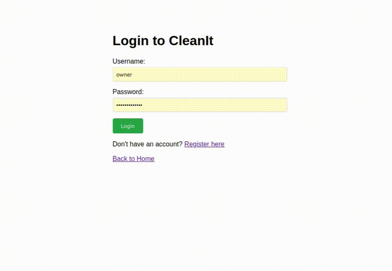

# CleanIt Job Management System

### Overview

The **CleanIt Job Management System** is a web application designed to simplify how cleaning jobs, teams, and cleaners are managed.  
It provides a **central dashboard** where owners, team leaders, and cleaners can view, assign, and track tasks efficiently.

The system is built using **Flask**, **SQLAlchemy**, and **Jinja2**, with **htmx** for dynamic front-end updates.

  

---

## Architecture

The system uses a **Model-View-Template (MVT)** structure, similar to MVC but suited for Flask applications.

### Core Layers

- **Model (SQLAlchemy)** – Handles database interactions safely and efficiently.  
- **View (Jinja2 Templates)** – Renders dynamic, user-friendly HTML pages.  
- **Controller (Flask Routes)** – Manages requests, business logic, and data flow.  
- **Hypermedia Layer (htmx)** – Adds interactivity without full page reloads, keeping the interface responsive.

---

## Tech Stack

| Category | Technology |
|----------|------------|
| Backend | Flask (Python) |
| Database | SQLAlchemy ORM (PostgreSQL / MySQL / SQLite) |
| Templating | Jinja2 |
| Frontend | htmx + DragulaJS |
| Styling | TailwindCSS |
| Testing | pytest, Flask-Testing, Selenium |

---

## Key Features

### User Management & Permissions
- **Role-Based Access Control:** Different dashboards for cleaners, team leaders, and owners.  
- **Owner Registration:** Owners can add users and assign roles.

### Daily Job Timetable
- **Cleaner View:** Shows only today’s assigned jobs.  
- **Team Leader View:** Displays all jobs for their team.  
- **Owner View:** Provides a full overview of all teams with jobs organised in columns.

### Interactive Job Cards
- **Quick Job Details:** Click to view more information in a popup.  
- **Drag-and-Drop Assignment:** Owners can reassign jobs between teams with DragulaJS.

### Critical Job Highlights
- **Back-to-Back Jobs:** Highlights jobs with tight turnaround times.  
- **Next-Day Arrivals:** Flags properties with upcoming guests to ensure timely completion.

### Job Editor Modal
- **Cleaner:** Read-only view of job details.  
- **Team Leader & Owner:** Editable modal to update job information, reports, and pictures.  
- **Owner:** Can create new jobs directly from the timetable.

---

## Security & Data Integrity

- **Authentication:** Session-based login with role enforcement.  
- **Authorisation:** Route-level access ensures users see only relevant data.  
- **Data Validation:** SQLAlchemy prevents SQL injection and Jinja2 templates escape content to prevent XSS.  
- **Logic Checks:**  
  - Cleaners → see only assigned jobs  
  - Team Leaders → manage only their team  
  - Owners → full system access  

---

## Development Practices

- **Server-Side Rendering:** Strong foundation for accessibility and SEO.  
- **Mobile-First Design:** Responsive layouts built with TailwindCSS.  
- **Progressive Enhancement:** htmx enriches the interface for smooth interactivity.  
- **Test-Driven Development:** Ensures robust and maintainable code through automated tests.

---

## Summary

The CleanIt Job Management System demonstrates a full-stack web application designed for efficient job management, role-based access, and interactive user experiences. It leverages modern Python frameworks, dynamic front-end enhancements, and secure development practices to provide a reliable system for managin
